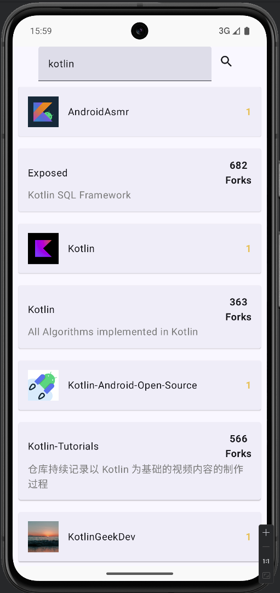
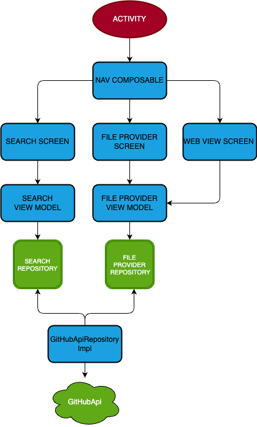

# GitHub Search Client
A mobile app for finding users and repositories on GitHub.

# Screenshots

## Credentials
The personal GitHub access token should be stored in the user's /Users/{username}/.gradle folder
in the gradle.properties file in the parameter GH_PAT=YourPAT

## Technology stack
Jetpack Compose, MVVM / MVI, Coroutines, Retrofit, Koin.

## Navigation graph

## Dependency graph
