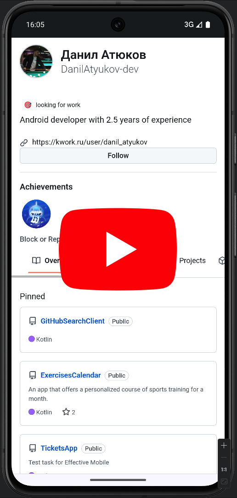

# GitHub Search Client

A mobile app for finding users and repositories on GitHub.

# Screenshots

| Search Screen                  | File Provider Screen                 | Video (youtube link)                                                                      |
|--------------------------------|--------------------------------------|-------------------------------------------------------------------------------------------|
|  |  |  |

# Architecture

| Navigation Graph                  | Dependency Graph                  |
|-----------------------------------|-----------------------------------|
|  |  |

## Technology stack

Jetpack Compose, Jetpack Navigation, MVVM / MVI, Coroutines, Retrofit, Koin.

## Credentials

The personal GitHub access token should be stored in the user's /Users/{username}/.gradle folder
in the gradle.properties file in the parameter GH_PAT=YourPAT